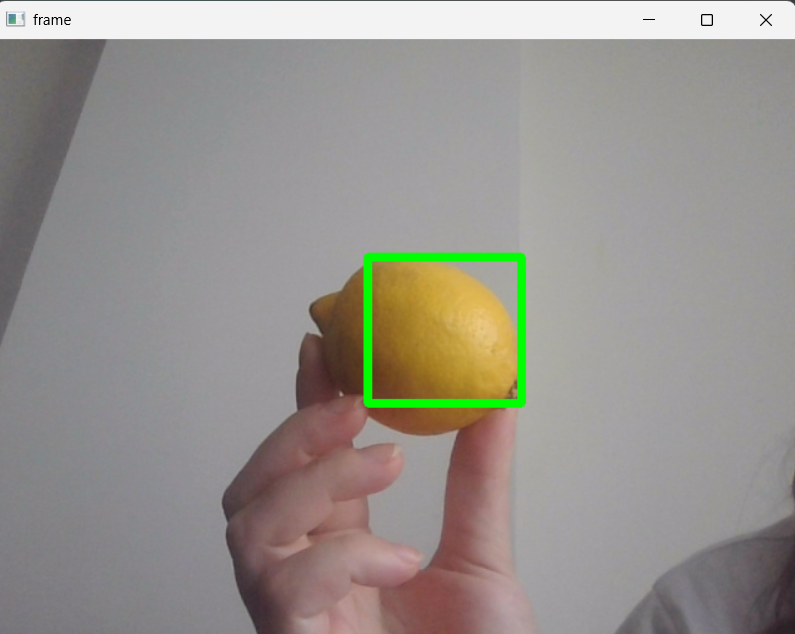
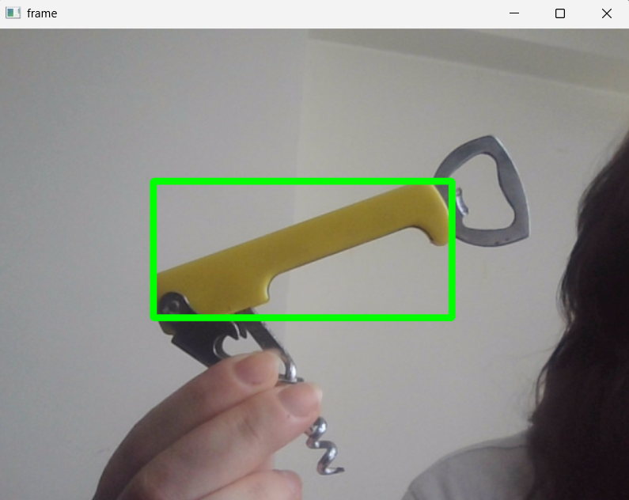

# 🎯 Color Detection with OpenCV

This project is a simple color detection application using OpenCV. It detects objects of a specific color in real-time from the webcam feed by drawing bounding boxes around them. The default color in the project is **yellow**, but it can be easily modified to detect any other color by changing the BGR values.

---

## 📂 Project Structure
├── main.py # Main script for detecting color via webcam

├── util.py # Utility function for calculating HSV color ranges

├── requirements.txt # Required Python packages

├── README.md # Project documentation

└── assets/

  - yellow_object_1.png 
  - yellow_object_2.png  

---

## 🔧 Requirements

To run this project, you need the following Python packages:

- `opencv-python==4.6.0.66`
- `numpy==1.23.4`
- `Pillow==9.2.0`

You can install them using the following command:

```bash
pip install -r requirements.txt
```

---

## ▶️ How to Run the Project
1. Clone or download this repository.
2. Install the dependencies:
```bash
pip install -r requirements.txt
```
3.Run the main script:
```bash
python main.py
```
4. A new window will open showing the live webcam feed. When a yellow object (or your target color) appears, a green bounding box will be drawn around it.
5. Press q to quit the application.

---

## 🎨 Change Detected Color
The default color is yellow in BGR format: [0, 255, 255].

If you want to detect another color:

* Open main.py

* Modify the yellow variable with the BGR values of the new color.
For example:
```python
blue = [255, 0, 0]  # For detecting blue objects
```
Then update:
```python
lowerLimit, upperLimit = get_limits(color = blue)
```
You can find BGR values for common colors [here](https://www.rapidtables.com/web/color/RGB_Color.html) or use a color picker tool.

---

## 🧠 How It Works
* The script reads frames from the webcam.

* Converts each frame from BGR to HSV color space.

* Calculates the HSV range of the target BGR color using get_limits() function from util.py.

* Creates a mask to isolate that color.

* Finds the bounding box of the detected region using Pillow.

* Draws a rectangle on the detected object in the webcam feed.

---

## 📸 Screenshots
Below are two sample detections of yellow-colored objects:

 

 
